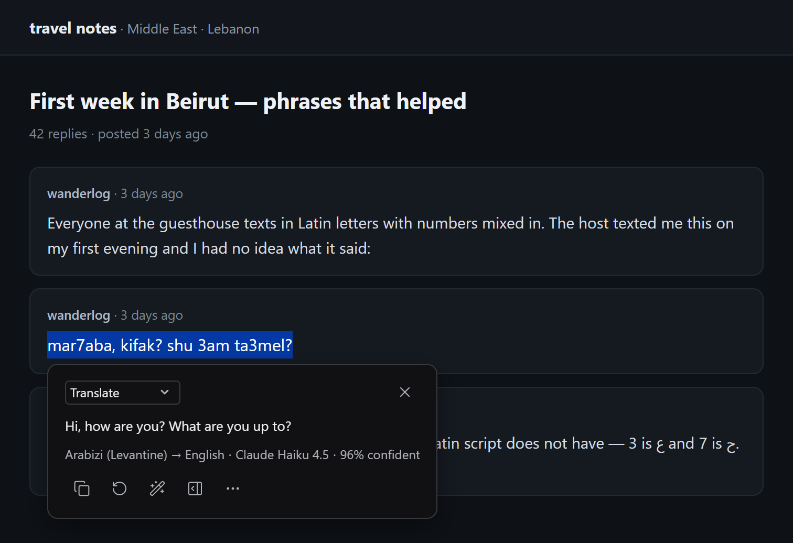
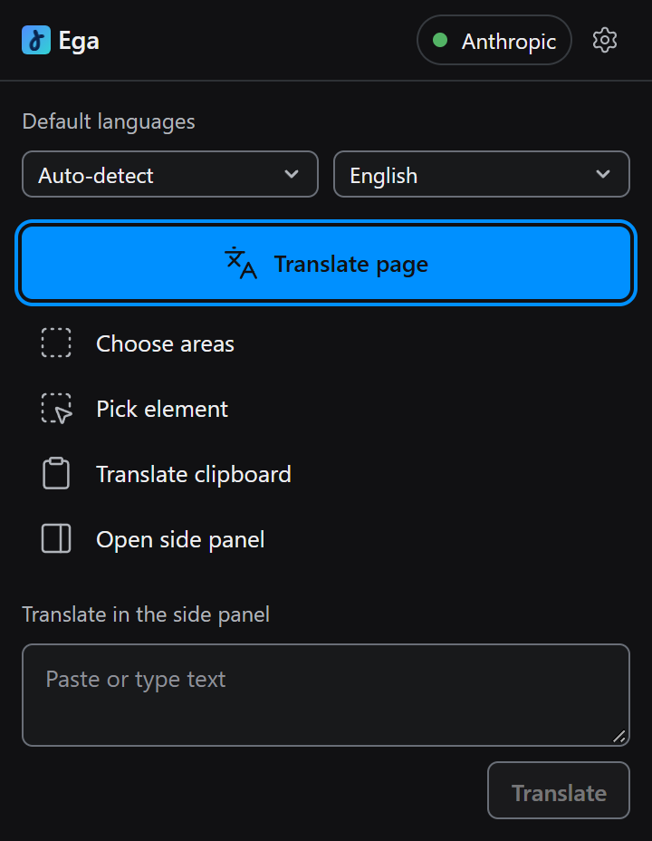
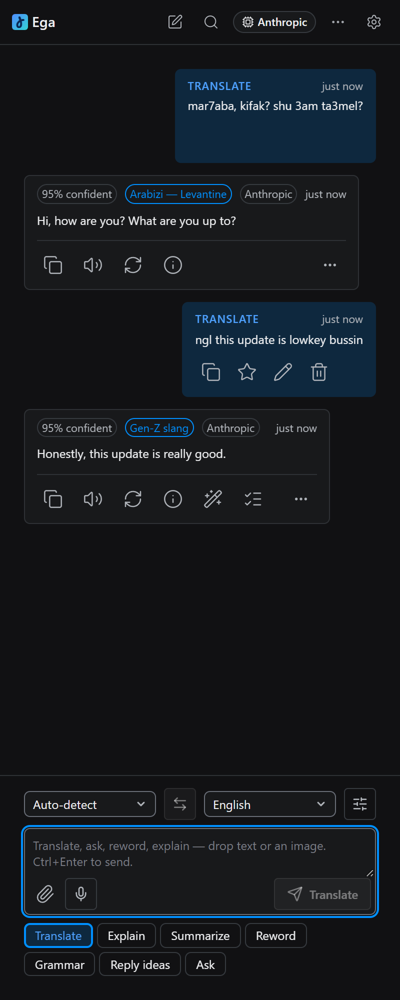
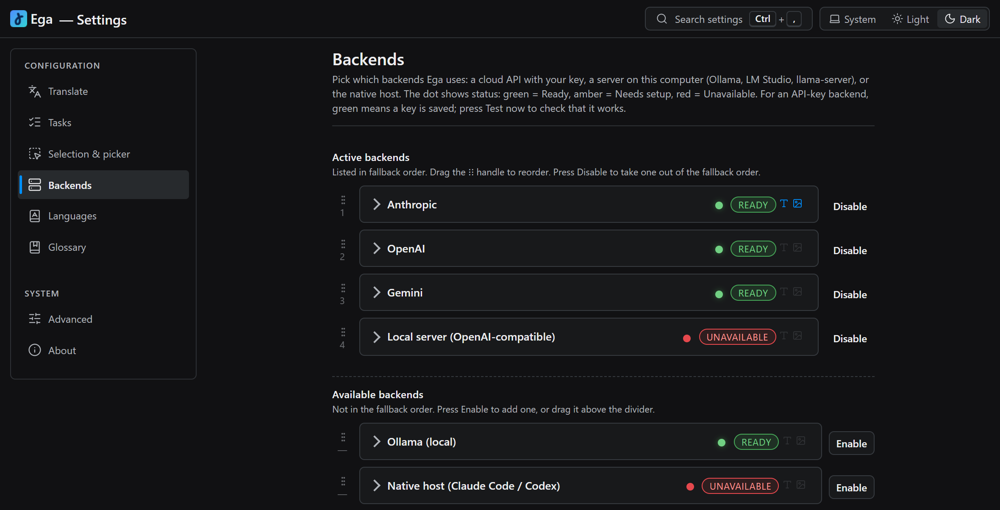

# Ega

> A Chrome extension that translates the text a normal translator gives up on —
> Arabizi, Gen-Z slang, Elvish, jargon from crypto / gaming / medical / legal, and
> any language you define yourself. It routes the selection to an LLM backend you
> choose and own.

**A personal, niche project, vibe-coded for fun.** There is no support, no promised roadmap
and no guarantee. Use it at your own risk, and expect rough edges.

<p align="center">
  
</p>

Select `mar7aba, kifak? shu 3am ta3mel?`, press `Ctrl+Shift+L`, get **Hi, how are you? What are
you up to?** A plain translator usually gives the letters back unchanged.

## Who it's for

You read or write in a language or dialect a plain translator cannot handle. You already have
an LLM you can use — a Gemini, Anthropic or OpenAI key, Ollama, LM Studio or
llama-server on your computer, or a local `claude` / `codex` CLI — and you would rather
send your text there than to a translation vendor. You want an answer on the page, not in
another tab.

## Install

Not on the Chrome Web Store yet. Load it unpacked.

You need Node 22.22.2 or newer (24.15 or newer on the 24 line), pnpm 10 (`corepack enable` picks up the pinned version) and Chrome
123 or newer, plus git if you clone. An older Chrome refuses to load the extension.

```bash
git clone https://github.com/el-f/ega.git
cd ega
pnpm i --frozen-lockfile && pnpm build
```

A ZIP download from GitHub also works. It has no `.git` folder, so `pnpm i` skips the
git hooks.

Then open `chrome://extensions`, turn on **Developer mode**, choose **Load
unpacked**, and select the `dist/` folder.

Ega opens its Settings page by itself on a fresh install. (Chrome's own menus call it
Options.) Go to **Backends** and do two things:

1. **Paste a key into one provider's card.** Google Gemini has a free tier and takes
   about a minute to set up. On the free tier, Google may use and review what you send
   (see [PRIVACY](docs/PRIVACY.md)). Google's [Gemini API terms](https://ai.google.dev/gemini-api/terms)
   say the API is for developers building for professional or business use, not for consumer
   use, and that you must be 18 or older. Read them before you use a key.
2. **Check that the provider sits under Active backends.** Only Anthropic, Gemini and
   the native host start enabled. Every other provider waits under **Available
   backends** and is never called until you press **Enable** on its card. Saving a key
   does not enable a backend on its own.

Tabs you already had open have no content script yet, so reload one. Then select text
on it and press `Ctrl+Shift+L` (`Cmd+Shift+L` on macOS).

The build embeds a fixed extension key, so the unpacked ID stays the same across
clones, worktrees and moves. Reloading from a new path does not break a native-host
install.

## It didn't work

**No bubble on the text I selected.** The bubble ships in smart mode, which hides it on
text under four characters in Latin letters (two in Arabic, Hebrew, Cyrillic, Chinese,
Japanese, Korean and other scripts) and on text made mostly of
common English words. Settings →
**Selection & picker** → **Selection bubble** → **Always** shows it on every selection.

**Nothing happens on a tab I already had open.** The content script only loads with the
page, and Ega has no permission to inject it into a tab that is already open. Reload the
tab.

**The shortcut does nothing.** Two separate bindings can fire it. Chrome owns one, at
`chrome://extensions/shortcuts` — Chrome leaves it unassigned, with no warning, when
another extension already holds the combo. Ega owns the other, at Settings →
**Selection & picker** → **Translate shortcut**; its default is the literal
`Ctrl+Shift+L` on every platform, macOS included, so on a Mac set it to
`Command+Shift+L` if you want that listener to fire too.

**Ollama answers 403.** `ollama serve` refuses the extension's origin until
`OLLAMA_ORIGINS` names it. Open **Extension access** on the Ollama card in Settings →
Backends: it shows the exact origin to copy and the command for Windows, macOS and
Linux.

**The local server does not answer.** Start it first: turn the server on in LM Studio, or
run `llama-server -m model.gguf`. LM Studio listens on port 1234 and llama-server on
8080; the two buttons on the **Local server** card in Settings → Backends fill in either
address. Ega sends no API key, so a server that requires one refuses it: llama-server
started with `--api-key`, or LM Studio with authentication turned on.

**The native host says it is not installed.** The host is registered for one extension
ID, so a new ID needs the install run again — see
[`docs/INSTALL_NATIVE_HOST.md`](docs/INSTALL_NATIVE_HOST.md).

## What you get

Select text and a small bubble appears — by default only when the text does not read
as plain English. Click it, or press the shortcut, and a tooltip streams the answer
back. Right-click instead to pick areas of the page, a single element, or an image.

Ega ships seven tasks: **Translate, Explain, Summarize, Reword, Grammar, Reply ideas,
Ask**. You can write your own on the Settings → **Tasks** tab. The tooltip and the
side panel offer the built-in tasks that are on, plus your own tasks. Turn a task off
on the Tasks tab and the pickers hide it. Explain is the one to reach for on slang — it
tells you what the text _means_, including the cultural reference a literal
translation flattens. The popup only translates. The right-click menu ships with
seven items under **Ega ▸**: Translate, Translate in side panel, Translate this page,
Pick an element to translate, Translate image in side panel, Explain image in side panel,
and Disable Ega on this site. Add the other tasks at Settings → Selection & picker →
**Right-click menu**. A turn that carries
an image offers Translate, Explain and your own tasks that have **Accept images** on.
No other task reaches the vision model.

<p align="center">
  
</p>

The side panel keeps your conversations for each site: follow-up questions, Refine
presets, versions of a reply, search and export. The site title at the top lists
every conversation.

<p align="center">
  
</p>

## Backends

Ten cloud providers, two kinds of local server, and a bridge to a CLI you already have.

| Backend             | Kind                                    | What it needs                             | Images        |
| ------------------- | --------------------------------------- | ----------------------------------------- | ------------- |
| Anthropic           | Cloud                                   | An API key                                | Yes           |
| OpenAI              | Cloud                                   | An API key                                | Yes           |
| Google Gemini       | Cloud                                   | An API key                                | Yes           |
| OpenRouter          | Cloud                                   | An API key                                | Yes           |
| Groq                | Cloud                                   | An API key                                | No            |
| DeepSeek            | Cloud                                   | An API key                                | No            |
| Together            | Cloud                                   | An API key                                | No            |
| Mistral             | Cloud                                   | An API key                                | No            |
| xAI                 | Cloud                                   | An API key                                | No            |
| Fireworks           | Cloud                                   | An API key                                | No            |
| Ollama              | Local; a cloud model runs on ollama.com | A daemon on loopback + `ollama pull`      | Vision models |
| Local server        | Local: LM Studio or llama-server        | The server running on loopback, no key    | Vision models |
| `claude` or `codex` | Existing CLI                            | The CLI installed and the host registered | Yes           |

An image request skips every backend in your chain that cannot read images. On a text
selection Ega then answers from the words alone; on a right-click image it stops and
tells you no image-capable backend is set up. If the only image backend runs a model that
cannot read images (an Ollama model without vision), Ega stops and names the model.
Ega does not check a local server's model ahead of time: a text-only model there answers
the image request with an error that names it. If an Ollama model answers an image with text
that is not in it, pull the model again (`ollama pull <model>`): an older download can list
vision and still not read the image, and Ega cannot tell.

If your `claude` or `codex` CLI is signed in with a plan that includes it, the native host
uses that login, so there is no second bill and no extra key. Ega's requests count against
the plan's usage limits. For Codex, the CLI comes with ChatGPT Plus, Pro, Business, Enterprise
and Edu, not with Free or Go ([OpenAI's Codex pricing](https://learn.chatgpt.com/docs/pricing)).

<p align="center">
  
</p>

Order all thirteen in one fallback chain. When one fails Ega moves to the next, as far as
**Fallback depth** in Settings → Translate — one extra backend by default, three at
most. Some failures stop the walk instead: a malformed reply, an unsupported request,
or any failure after the answer has started streaming.

A cloud request is billed to your own key at that provider's price. "Translate page" sends one
request per text block as you scroll to it, and a block that hits a rate limit or a network error
is sent up to two more times. A request that fails on one backend can go on to the next one in your chain,
which may be paid too. **Fallback depth** caps that walk, and **Batch concurrency** (also in
Settings → Translate) sets how many blocks go out at once.

**Active backends** at the top of the tab is that order. Press **Enable** or **Disable**
on a row, or drag it across the divider.

The dot on each row is green for ready, amber for needs a key, red for unreachable.
A cloud provider with a saved key shows a grey dot and **Key saved**: Ega sends that
provider nothing until you translate or press **Test now**, and a passed test turns the
dot green and the label to **Verified**. The one exception is OpenRouter: once its key is saved,
Ega reads its public model list (no key, no text) to learn which models think. Ollama, the local server and the native host are probed for real. **Test
now** on any card runs a real request through it.

## Privacy

Ega has no server and sends no telemetry. There is no account. Translation
requests go to the backend you configured.

Four other things can leave your browser:

- **Page context, on every translation.** It is on by default and carries the page
  title, the URL cut to origin and path, and the text on each side of your selection.
  Turn it off at Settings → Translate → **Page context**.
- **The page's image, when you press Explain.** If the page has one clearly dominant
  image, Explain downloads it and sends it with your text — even when you selected
  text, not an image. It ships on; the switch is Settings → Translate → Page context →
  **"Explain can read the page image"**.
- **The image you right-clicked.** Image translation downloads the picture from the
  site that hosts it and sends the bytes to the backend.
- **Your voice, when you dictate.** The side panel's microphone uses Chrome's speech
  recognition, which is a Google service.

Ega asks for access to every site for two reasons: the content script has to run
wherever you might select text, and image translation fetches the picture from
whatever origin serves it.

Settings live in `chrome.storage.local` and are never synced. Password, payment and
secret-looking fields are skipped — Ega matches a field's name, id, placeholder and
labels, not just its type.

Three documents carry the detail: [`docs/PRIVACY.md`](docs/PRIVACY.md) lists every
outbound flow, exactly what page context is attached, and everything kept on disk;
[`docs/PERMISSIONS.md`](docs/PERMISSIONS.md) says why each Chrome permission is asked
for and what can read each storage slot; [`docs/THREAT_MODEL.md`](docs/THREAT_MODEL.md)
says what Ega defends against, and what it does not.

## Make it yours

- **Languages** — define a custom language with a hint for the model and a few examples.
- **Tasks** — edit the prompt of each task, write tasks of your own, and turn off the ones
  you never use. A language can have its own prompt too.
- **Glossary** — pin terms that must always render a certain way.
- **Rules** — plain-language instructions scoped to a task or a site.

## If Ega ever ships on the Web Store

Every unpacked build from this repo gets the same extension ID. A Web Store install
would get a different one from the store, and Chrome treats a different ID as a
different extension: the unpacked copy's settings, API keys, glossary, custom languages
and saved threads do not carry over, and the native host stops answering until it is
registered for the new ID.

If you ever move between the two, back up first. **Settings → Advanced → Data → Backup &
restore** exports settings, glossary, custom languages and your own tasks (tick the box for API keys),
and each side-panel thread exports on its own from the panel. Then re-run the
native-host install for the new ID, as in
[`docs/INSTALL_NATIVE_HOST.md`](docs/INSTALL_NATIVE_HOST.md).

## Development

Same prerequisites as [Install](#install): git, Node 22 and pnpm 10.

```bash
pnpm i --frozen-lockfile
pnpm exec playwright install --with-deps chromium   # once per machine, for pnpm test:e2e
pnpm dev          # vite in watch mode
pnpm typecheck    # tsc + svelte-check
pnpm lint         # eslint
pnpm test         # vitest: unit, integration, property, explore
pnpm test:all     # + the native-host suite
pnpm test:e2e     # Playwright; builds dist/ itself, no prior build needed
pnpm test:e2e tests/e2e/first-run.spec.ts   # one spec, about 2 minutes with the build
pnpm build && pnpm zip
```

`pnpm i` also installs git hooks with lefthook. On Linux, `--with-deps` installs Chromium's
system libraries and asks for sudo. The full end-to-end suite runs on one worker and takes
25 minutes on a CI runner and up to an hour on a laptop, so start with one spec.

Two of these surprise people:

- `pnpm test:e2e` rebuilds `dist/` with the end-to-end test hooks compiled in, and
  leaves it that way. Those hooks take commands through the DOM, so run `pnpm build`
  again before you load `dist/` in a browser you actually use — a normal build strips
  them.
- `pnpm verify` starts with `format:check`, so one unformatted file stops the gate
  before a single test runs. Run `pnpm format` first after a scripted edit.

`pnpm verify` is the full local gate: format, types, every lint and audit script, both
test suites with coverage, generated files, build, zip, a native-host install check, a
secret scan and a production dependency audit. It does not run the Playwright suite.
The install check runs the real installer against a temporary folder. On Windows it
saves your own `com.ega.host` registry entries first and puts them back when it ends.

Commits follow Conventional Commits. lefthook runs the fast checks on commit; on push
it runs both test suites, svelte-check, and the doc-link, notices, dead-code,
bundle-budget, flow-coverage and affordance gates, so a push takes several minutes.

Unit tests run in the node environment. A test that touches a DOM says so on its
first line — `// @vitest-environment jsdom` — because building a jsdom for every
file cost more than every test in the suite put together.

**Stack:** Svelte 5 runes · TypeScript strict · Vite · Vitest · Playwright · Chrome
MV3 · pnpm · Node 22.

Architecture in [`docs/ARCHITECTURE.md`](docs/ARCHITECTURE.md).

## Status

Version 0.0.1, alpha. The settings schema still changes between versions.

Issues, discussions and outside pull requests are off. You can read the code, use it and
fork it under the MIT license.

## License

MIT — see [LICENSE](LICENSE). It covers the original source in this repository.

The built extension bundles third-party packages that keep their own licenses; they
are listed with their notices in [THIRD_PARTY.md](THIRD_PARTY.md), which also ships
inside the packaged zip.

The app icon is the letter ע set in [Gveret Levin](https://github.com/AlefAlefAlef/gveret-levin)
by AlefAlefAlef, under the SIL Open Font License 1.1. The font and its license live in
`scripts/icon-font/`; `pnpm gen:icons --force` redraws the committed PNGs from it.
