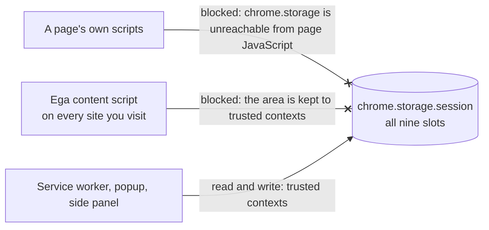

# Ega — permissions

_Last updated: 2026-10-02. Applies to Ega 0.0.1._

What Ega asks for, and why each one is needed. The list Chrome shows comes from
`manifest.config.ts`.

Chrome asks in two places. Install-time permissions are in the prompt you accept when you
add Ega. On-demand permissions are not: Chrome asks the first time the feature that needs
one runs, and you can say no and keep everything else.

**Install time** (`permissions` and `host_permissions` in the manifest):

| Permission                     | Why Ega needs it                                                                                             |
| ------------------------------ | ------------------------------------------------------------------------------------------------------------ |
| `storage`                      | Keep settings, custom languages, side-panel conversations, the request log and handoff state on this device. |
| `contextMenus`                 | Add the Ega right-click items.                                                                               |
| `nativeMessaging`              | Optional bridge to a local `claude` or `codex` CLI.                                                          |
| `sidePanel`                    | Open the side panel.                                                                                         |
| `host_permissions: <all_urls>` | Run on any page, fetch images you right-click, and call your chosen backend.                                 |

**On demand** (`optional_permissions` in the manifest):

| Permission      | When Chrome asks                                                                  |
| --------------- | --------------------------------------------------------------------------------- |
| `clipboardRead` | The first time you press **Translate clipboard** in the popup. Never before that. |

## `storage`

Two areas, both local to this browser profile. This section says what each
`chrome.storage` key holds, its limits and the code behind it. The full key list,
with the Settings page's `localStorage` and `sessionStorage` keys, is the Storage
shape table in [docs/ARCHITECTURE.md](ARCHITECTURE.md#storage-shape);
`tests/unit/privacy/storage-keys.test.ts` fails when a key in `src/` is missing
from it. `docs/PRIVACY.md` says what each store means for you, and
`docs/THREAT_MODEL.md` says what an attacker gets from it.

### `chrome.storage.local` — survives a browser restart

| What                       | Key                     | Limits                                                                                                                            |
| -------------------------- | ----------------------- | --------------------------------------------------------------------------------------------------------------------------------- |
| Settings and API keys      | `ega.settings`          | —                                                                                                                                 |
| Custom languages           | `ega.customLanguages`   | —                                                                                                                                 |
| Custom tasks               | `ega.customTasks`       | 50 tasks.                                                                                                                         |
| Side-panel conversations   | `ega:conv:t:<id>`       | One key per conversation, several per site; the id starts with the origin, in clear. 50 conversations, 300 turns and 512 KB each. |
| The list of conversations  | `ega:conv:index`        | One row per conversation: its site, times, message count and title (first line of its first message, up to 80 characters).        |
| Recent requests          | `egaAuditLog`           | Last 50 requests, text and image alike. Prompt and reply cut to 200 characters, 1000 on a failure.                                |
| Which Settings tab to open | `ega.pendingOptionsTab` | A tab name, none of your text. Written just before Settings opens, deleted when that page reads it.                               |

**Side-panel conversations are the largest store of page content Ega keeps at
rest.** Details, because the size is easy to underestimate:

- Ega saves the thread by itself, a moment after every change
  (`src/sidepanel/state/conversation-store.ts#saveThread`). A discrete action —
  bookmark, delete, pick a variant — is written straight away, without the delay.
  There is no setting that turns this off.
- A turn keeps the **full** text you sent and the **full** model reply. No
  200-character clamp applies here — that clamp belongs to the audit log
  alone.
- A turn also keeps the explain note, every earlier version of the reply that
  a refine produced, and the page-context snapshot that went out with the
  request (`contextSent`).
- With **Record request details** on, a reply also keeps the instructions Ega
  sent the model (the system prompt), cut at 6,000 characters. Only the 20
  newest replies of a conversation keep them
  (`src/sidepanel/state/conversation-store.ts#leanInstructions`).
- An image turn keeps the image itself as a data URL, up to 256 KB. A bigger
  image is dropped and replaced with placeholder text
  (`src/sidepanel/state/conversation-store.ts#capTurnSize`).
- The index is a record of **every site you used the side panel on**. It holds
  the origin in clear text — and so does each conversation's key, so
  `chrome.storage.local.get(null)` lists the sites without reading a single
  conversation. Each index row also keeps the conversation's title (the first
  line of its first message, up to 80 characters), its message count, and when
  it was last opened.
- Past 50 conversations the least recently used one is deleted. Inside a thread, turns
  drop from the oldest end past 300 turns or past 512 KB. A single turn over
  300 KB is cut back to its visible text, capped at 20,000 characters, and loses
  every earlier version a refine produced
  (`src/sidepanel/state/conversation-store.ts#shrinkTurn`). The page-context
  snapshot and the image survive that cut — the image is shed separately, under
  thread-level quota pressure. Across all threads the budget is 4 MB
  (`src/sidepanel/state/conversation-store.ts#MAX_TOTAL_THREAD_BYTES`).
- To delete a conversation, use **Delete** on its row in the side panel's
  conversations list (the site title at the top), or in **Settings → Advanced →
  Data → Saved conversations**. Both remove every turn, and keep the site name
  plus the ids of the removed turns so a second Chrome window cannot write them
  back. **New conversation** deletes nothing: the old conversation stays in the
  list. **Delete all** in the same list removes every thread. **Settings → Advanced → Data →
  Delete all data** removes everything.

The audit log keeps the last 50 requests, text and image alike, and clamps each
prompt and response to 200 characters (1000 when the request failed, so a bug
report has context). A finished request also keeps the input and output token
counts its backend reported, and the log shows their total.
Read it at **Settings → Advanced → Diagnostics → Recent requests**, and clear
it there.
There is no off switch. Every request Ega routes to a backend is recorded — see
[What the audit log covers](#what-the-audit-log-covers).

A page translate sends one request per text block, so it could fill the log
by itself. It cannot: at most 10 of the 50 rows are page-translate blocks
(`src/shared/audit-log.ts#AUDIT_BATCH_CAP`), so your interactive requests keep
the other 40. The cap counts block rows in the log, not rows per page translate
— two page translates still leave 10 block rows in total. Even so, do not treat
the log as a history of your day.

### `chrome.storage.session` — dies when you close the browser

Nine slots:

- `ega:discovery:<backend>` — discovered model lists per backend, plus a hash of
  the API key they were fetched with,
- `ega.openrouterReasoning` — OpenRouter's public list of which models think and the
  effort levels each takes, kept 12 hours,
- `ega.pendingImageSeed` — an image waiting to be handed to the side panel,
- `ega.popupDraft` — your unsent popup draft,
- `ega.sidepanelDraft:<window>` — your unsent side-panel composer draft,
- `ega.sidepanelDraftImage:<window>` — an image you attached in the composer and
  have not sent, as a data URL up to 256 KB or the image's web address
  (`src/sidepanel/state/composer-draft.ts#writeComposerDraftImage`). Both draft
  slots are one key per browser window, or the bare `ega.sidepanelDraft` /
  `ega.sidepanelDraftImage` key when the panel cannot read its window id. Keys
  left by closed windows are swept
  when a panel mounts (`src/sidepanel/state/composer-draft.ts#pruneOrphanDrafts`),
- `ega.audit-log.filters` — your request-log filters on the Settings page,
  including what you typed in its search box,
- `ega.menusBuilt` — a yes/no flag: the right-click menu is built for this
  browser session, so a worker wake does not rebuild it,
- `ega.pendingPopupHandoff` — the pending popup/tooltip handoff. **This slot
  holds page content.** It carries the text you selected or typed, the model's
  answer, the explain brief, the text read out of an image, and the image itself
  as a data URL. Ega writes it whenever you send something to the side panel.
  The slot holds a queue, one entry per send, each tagged with the browser window
  it came from (`src/shared/pending-popup-handoff.ts#drainPendingPopupHandoff`).
  A panel drains its own window's entries and leaves the rest for the panel they
  belong to; when nothing is left it removes the slot. Entries older than 60
  seconds are ignored on read and are not cleared: they stay until the next
  handoff overwrites the slot or you close the browser.

No content script can read this list. The service worker keeps session storage
to trusted contexts on startup (`chrome.storage.session.setAccessLevel({
accessLevel: 'TRUSTED_CONTEXTS' })` in `src/background/index.ts`). Who can reach
the area:



The popup still pre-fills a selection that opening it dropped. The page keeps
that selection in its own memory, never in storage, and hands it over only when
the popup asks (`src/content/index.ts#selectionForPopup`). Three things to know.

- It needs no click. Selecting text is enough.
- Two gates run **before** the page keeps it: the sensitive-field check (the full
  list under "Sensitive inputs Ega will not read" in `docs/PRIVACY.md`), then the
  per-site "Disable Ega on this site" check
  (`src/content/index.ts#handleSelectionChange`). A site you turned Ega off on
  keeps nothing.
- It is cut to 2000 characters and is given out for one minute. It goes with the
  tab.

The handoff slot holds page text, an answer and an image from whatever site you
sent them from. Keeping the area to trusted contexts means Ega's content script on
another site cannot read it. The service worker and the popup write it, the side
panel reads it, and a tooltip that wants to hand something over messages the
worker instead (`src/content/tooltip/handoff.ts`).

### What the audit log covers

Every request Ega sends to a backend writes one entry, whichever surface
started it:

| Path                  | Where the entry is written                                              |
| --------------------- | ----------------------------------------------------------------------- |
| Text translate        | `emitAudit`, inside `src/background/router.ts#handleTranslate`.         |
| Image translate       | `emitAudit`, the same one: an image request runs the text path.         |
| Image explain         | Same place. The right-click image item routes through the same handler. |
| Backends → "Test now" | `src/options/components/BackendCard.svelte`, tagged `backend-test`.     |

The image entry records the prompt and the answer, not the image bytes. The
picture itself is never copied into the log.

Two cases write nothing, because no request was built: a backend that reports
itself unreachable while another one in the chain answers, and a "Test now" that
fails its availability probe.

Two more write a row even though no backend was called. A cache hit records the
reply it served (`src/background/router.ts#serveFromCache`), and a translate with
no reachable backend at all records the failure
(`src/background/router.ts#failWithoutBackend`). Both rows name the backend as
`unknown`.

Ega never writes to `chrome.storage.sync`, so none of this rides your Google
account to other machines. Nothing leaves the device through this permission.

## `contextMenus`

Registers the right-click items, all under one **Ega ▸** submenu. You can rename,
reorder, hide or add items in **Settings → Selection and picker → Right-click menu**.
The defaults are:

- Translate
- Translate in side panel
- Translate image in side panel
- Explain image in side panel
- Translate this page
- Pick an element to translate
- Disable Ega on this site

## `nativeMessaging`

Drives the optional native host, which lets Ega run your local **Claude Code**
(`claude`) or **Codex** (`codex`) CLI instead of a hosted API. Nothing runs
until you install the host. The native backend is on by default, and you can
turn it off in **Settings → Backends**. See
[INSTALL_NATIVE_HOST.md](INSTALL_NATIVE_HOST.md).

## `clipboardRead`

Backs **Translate clipboard** in the popup. Ega reads the clipboard only
when you click it.

This one is not in the install prompt. It sits in `optional_permissions`, so the
popup asks Chrome for it inside your click, and only the first time
(`src/popup/Popup.svelte`). Decline and the rest of Ega is unaffected.

## `sidePanel`

Opens the side panel. Four kinds of trigger, every one started by your click:

- the popup — its **Open side panel** and **Translate clipboard** buttons, and sending
  typed text from the popup box,
- the "Ega ▸ Translate in side panel" right-click item,
- the image right-click items ("Translate image", "Explain image"), which
  need a bigger surface than the tooltip,
- the tooltip's escalate buttons — **Continue in side panel** on an error,
  **Pin to side panel** on an explain result, and **Open in side panel** on an
  image result or a failed image.

Every trigger that carries text or an image with it writes the handoff slot described
under `storage` above, so the panel opens with your text already in it. A failed
image lands in the composer and waits for you to send it. When the image itself
failed, or the panel cannot take it, the panel opens empty and the page asks
you to attach the image there. The
**Open side panel** button carries nothing and writes nothing.

## `host_permissions: <all_urls>`

**This is the broad one.** It covers four flows.

**1. Content script on every page.** Selection, hotkey, element picker,
inline replace and page translate all run in the page.

Page translate is the widest of these. It starts only when you press
**Translate page** in the popup or pick "Ega ▸ Translate this page"
(`src/content/page-translate-v2/index.ts#runWholePageTranslate`). Ega sends the
page's text blocks one screen at a time: a block goes out when it is on screen or
within one screen height of it, so text you never scroll to is not sent. Each
block is its own request. Code, form fields, hidden text, text marked
`translate="no"`, password and card fields, and blocks over 2000 characters are
not sent (`src/content/page-translate-v2/collect.ts#collectBlocks`). **Stop**
sends nothing more.

**Choose areas** in the popup is the narrow form: you hover the page, click each
block you want, and press Enter
(`src/content/page-translate-v2/multi-select.ts#enterMultiSelect`). A block over
2000 characters, an empty one, an already-translated one, and `<html>` /
`<body>` / `<head>` are refused when you click them
(`src/content/page-translate-v2/multi-select.ts#selectReject`). Pick twenty
paragraphs and twenty paragraphs go out; nothing you did not click is read.

**2. Image fetches.** Right-clicking an image — or pressing Explain on a text
selection while the page carries one dominant image — makes the service worker fetch
that image's `src`, which can be any origin. An MV3 service worker does not
inherit the page's origin, so `<all_urls>` is what gets the fetch past CORS.
The fetch is guarded before it runs: only `http`/`https` URLs and raster data
URLs pass, SVG is rejected, redirects are refused, and the result must be a
PNG / JPEG / WebP / GIF under 4 MB. The address guard blocks `0.0.0.0/8`,
link-local and cloud metadata (`169.254.0.0/16`), carrier-grade NAT
(`100.64.0.0/10`), multicast and reserved space, the whole IPv6 `fe80::/10`
block and `fd00:ec2:`, `.local` and `.internal` hostnames, and the
IPv4-mapped IPv6 form of each.

Loopback (`127.0.0.0/8`) and private ranges such as `10.0.0.0/8` and
`192.168.0.0/16` are **allowed on purpose**: the page already rendered that
image, so the browser could already reach the host.

The image is then base64-encoded and sent to the backend you picked — which
may be a local one. On the native CLI backend it also lands on disk on the way:
the host writes the decoded picture to your OS temp folder as `ega-img-<uuid>`
before spawning the CLI, because those CLIs take an attachment by path
(`native-host/ega-host.mjs#handleTranslateImage`). It is unlinked on completion
and on error, but a killed host leaves the file behind.

**3. Backend API calls.** `<all_urls>` covers every provider, so the manifest
does not list them one by one. The full set Ega can call:

| Backend        | Origin                                                            |
| -------------- | ----------------------------------------------------------------- |
| Anthropic      | `https://api.anthropic.com`                                       |
| Google Gemini  | `https://generativelanguage.googleapis.com`                       |
| OpenAI         | `https://api.openai.com`                                          |
| Groq           | `https://api.groq.com`                                            |
| DeepSeek       | `https://api.deepseek.com`                                        |
| Together       | `https://api.together.xyz`                                        |
| Mistral        | `https://api.mistral.ai`                                          |
| xAI            | `https://api.x.ai`                                                |
| Fireworks      | `https://api.fireworks.ai`                                        |
| OpenRouter     | `https://openrouter.ai`                                           |
| Ollama (local) | `http://localhost:11434` by default                               |
| Local server   | `http://127.0.0.1:1234` (LM Studio) by default; any loopback port |

Ega calls only the backend you configured. The native host makes no browser
network call at all — it talks to the local CLI over stdin/stdout.

**4. Tab addresses.** Ega has no `tabs` permission. `<all_urls>` is what makes
`chrome.tabs` return each tab's URL, and Ega reads it for two things: the side
panel follows the active tab so it loads that site's current conversation
(`src/sidepanel/state/active-origin.ts#getActiveOrigin`), and the right-click
item is relabeled for the current host
(`src/background/contextMenu.ts#refreshSiteToggleLabel`). Nothing reads a tab's
title — the page title in a prompt comes from `document.title`, read by the
content script (`src/content/page-context-collector.ts#collectPageContext`). No
tab URL leaves the device except as the page-context URL, cut to origin and
path.

### What Ega does not do with `<all_urls>`

- No telemetry. No pings home.
- No analytics or metrics endpoint of any kind.
- No prefetching, no background scraping.
- No cross-tab data correlation.

To audit this yourself, grep `src/` for `fetch(`. There are only three kinds
of hit: the backend providers in `src/shared/backends/`, the image fetch in
`src/background/router-image.ts`, and two calls to your own Ollama from the
Backends tab — the model list and an `OPTIONS` preflight that detects the 403
below (`src/options/components/OllamaBackendRow.svelte`). Every backend has its
own unit tests plus a shared conformance suite
(`tests/_helpers/conformance.ts`) that pins the request shape, so a
parser change shows up at PR time.

## `commands.translate-selection`

Registers the default shortcut: `Ctrl+Shift+L`, or `Command+Shift+L` on macOS.
Remap it at `chrome://extensions/shortcuts`.

## Ollama — you must allow the extension origin

Ollama blocks cross-origin callers by default. `/api/tags` answers anyone, so
Ega can list your models, but `/api/chat` — the endpoint that actually runs
the model — returns HTTP 403 to a `chrome-extension://` origin until you set
`OLLAMA_ORIGINS`.

Allow only Ega, not everyone. A wildcard lets any site and any installed
extension reach your Ollama.

The Backends tab shows your exact origin with a copy button, and runs the 403
check when you discover models. Set the variable where `ollama serve` runs:

| OS      | Command                                                          |
| ------- | ---------------------------------------------------------------- |
| Windows | `setx OLLAMA_ORIGINS "chrome-extension://<your-extension-id>"`   |
| macOS   | `launchctl setenv OLLAMA_ORIGINS "chrome-extension://<your-id>"` |
| Linux   | systemd: the three steps below                                   |

Then restart Ollama. On Windows the variable must be visible to the tray app
or service, not just to your shell, so restart the app after `setx`.

If Ollama runs as a systemd service (the Linux install script sets one up), the
variable goes into the service. Open an override file:

```sh
sudo systemctl edit ollama.service
```

Add these two lines and save:

```ini
[Service]
Environment="OLLAMA_ORIGINS=chrome-extension://<your-id>"
```

Then reload systemd and restart Ollama:

```sh
sudo systemctl daemon-reload && sudo systemctl restart ollama
```

The "Expose to network" toggle in the Ollama app only changes the bind
address. It does not let extensions through.
